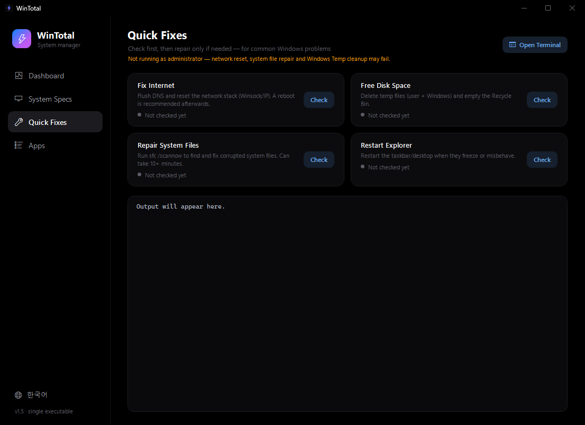

<div align="center">

# ⚡ WinTotal

**All-in-one Windows system utility in a single ~146 KB executable.**

No installer · no frameworks to download · no background services — just one file.

[](#getting-started)
[](#why-is-it-so-small)
[](#why-is-it-so-small)
[](LICENSE)


</div>

## Highlights

- **Real-time dashboard** — CPU · GPU · memory · disk, refreshed every second, with 60-second history charts and top-process lists
- **Health check** — SMART status, SSD wear, GPU thermals and throttling, memory pressure, battery wear; runs automatically, expands on click
- **Full system specs** — one-click rescan across 11 hardware/OS sections, with proof of what was scanned
- **Quick fixes** — check-first, one-click repairs for network, disk space, system files, and a frozen Explorer
- **App manager** — desktop + Store apps in one list; uninstall with registry cleanup, force delete for stubborn leftovers
- **English / Korean UI** — one-click switch, remembered across runs

## Features

### Real-time dashboard

- CPU · GPU · Memory · Disk usage with 60-second history graphs
- GPU usage computed the way Task Manager does it (max across summed engine types)
- Live GPU telemetry via `nvidia-smi` — temperature, power draw, VRAM used / total
- Top 5 CPU / GPU / memory processes, including **per-process VRAM** (e.g. `python — 0.4 GB`), so you can see exactly what is eating your GPU during training
- Graceful close button on every process row: sends a close request first (so the app can ask you to save), and only force-kills after you confirm. 23 critical Windows processes are protected from termination

### Health check

A compact strip at the top of the dashboard — runs automatically on startup and every 10 minutes, and expands into the full green / yellow / red report when clicked:

- Disk SMART status, SSD wear level, disk temperature, free space per drive
- GPU temperature, thermal/power throttling, VRAM headroom, power draw vs limit
- Memory pressure and commit charge
- Battery wear (full-charge vs design capacity)
- Secure Boot, uptime (reboot reminder), thermal zone when the system exposes it


### System specs

One click on **Rescan** re-scans the whole machine and shows proof of the scan (timestamp · duration · sections · items verified):

- OS edition, build, install date · manufacturer & model
- CPU cores, threads, clocks, cache · GPU model, VRAM, driver, resolution
- Per-slot RAM details · storage with NVMe / SSD / HDD detection
- Motherboard & BIOS · connected monitors · battery health (wear vs design capacity)
- Secure Boot & TPM status · network adapters with link speed


### Quick fixes

One-click repairs for the things people usually have to google terminal commands for. Each tile **checks first** and only offers the repair when it is actually needed; every action streams its console output into the built-in dark panel:

- **Fix Internet** — flush DNS, reset the Winsock/IP stack
- **Free Disk Space** — clear user + Windows temp files, empty the Recycle Bin
- **Repair System Files** — `sfc /scannow` with live progress
- **Restart Explorer** — un-freeze the taskbar/desktop
- **Open Terminal** — for power users



### App manager

- Desktop apps (64/32-bit registry + per-user) and Microsoft Store apps in one list
- Automatic categories — AI Tools / Development / Games / Internet & Chat / Media & Creative / Security / Utilities / System Components
- Instant search across name, publisher, and package name
- **Uninstall** — runs the official uninstaller, then cleans leftover registry keys
- **Force Delete** — removes the registry entries and the install folder immediately; handy for apps that leave traces behind
- **Running detection** — apps with live processes get a green `Running` badge and an **End** button (close request first, confirmed force kill only as a last resort)


### English / Korean UI

Switch languages with one click (bottom-left globe button). The choice is remembered, and the default follows your system language.

## Getting started

Download `WinTotal.exe` from [Releases](https://github.com/SeanPresent/WindowsTotalManager/releases) and run it.

- **Administrator rights (UAC) are required** — HKLM registry cleanup needs them
- SmartScreen may warn about an unsigned executable → *More info → Run anyway*. If you'd rather not trust a random binary, read `WinTotal.cs` and build it yourself — that's exactly why the source is here

### Build from source

Any Windows 10/11 machine can build it — the compiler ships with Windows, no Visual Studio required:

```powershell
git clone https://github.com/SeanPresent/WindowsTotalManager.git
cd WindowsTotalManager
.\make_icon.ps1    # once — generates icon.ico
.\build.ps1        # release → WinTotal.exe      (requires admin at runtime)
.\build.ps1 -Dbg   # debug   → WinTotal_dbg.exe  (no UAC, for testing)
```

### Command-line flags

| Flag | Effect |
| --- | --- |
| `--specs` · `--fix` · `--apps` | open directly on that page |
| `--apps=<query>` | open the Apps page with the search pre-filled |
| `--en` · `--ko` | force the UI language for this run |
| `--demo` | hide identifiable values (useful for screenshots) |

## Why is it so small?

- **Zero** external frameworks or libraries — only the .NET Framework 4.8 WPF that ships inside Windows
- The entire UI is built in code from a single source file — there isn't even any XAML
- It compiles with the `csc.exe` bundled with Windows

## Disclaimer

**Force Delete** permanently removes registry keys and install folders. Safeguards are in place (a protected-key list, exact-name matching only, system-path guards), but this software is provided **AS IS**, without warranty of any kind. Use at your own risk.

## License

[MIT](LICENSE)
