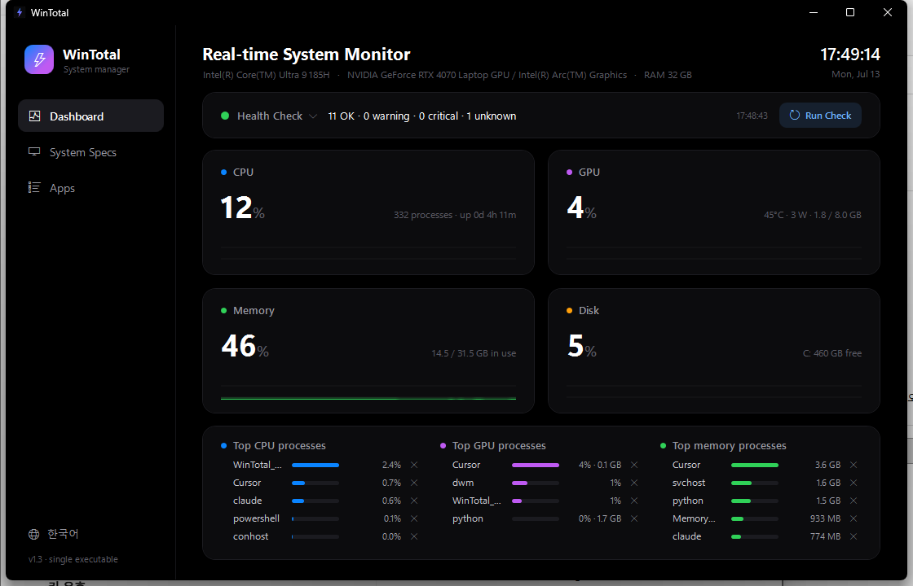
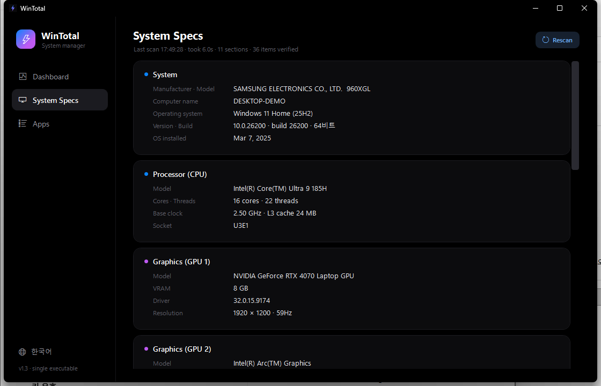
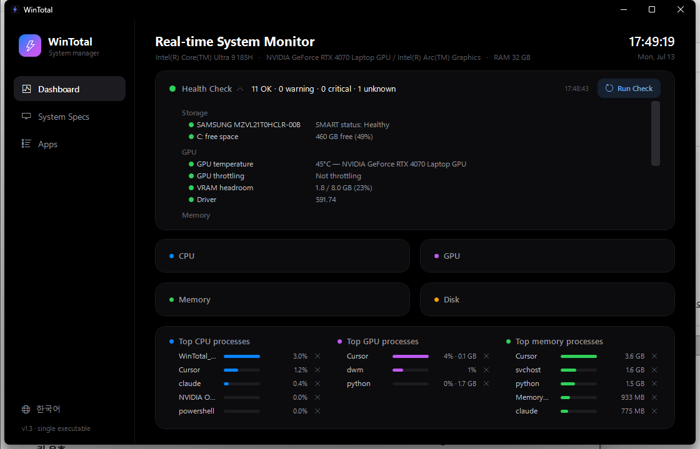
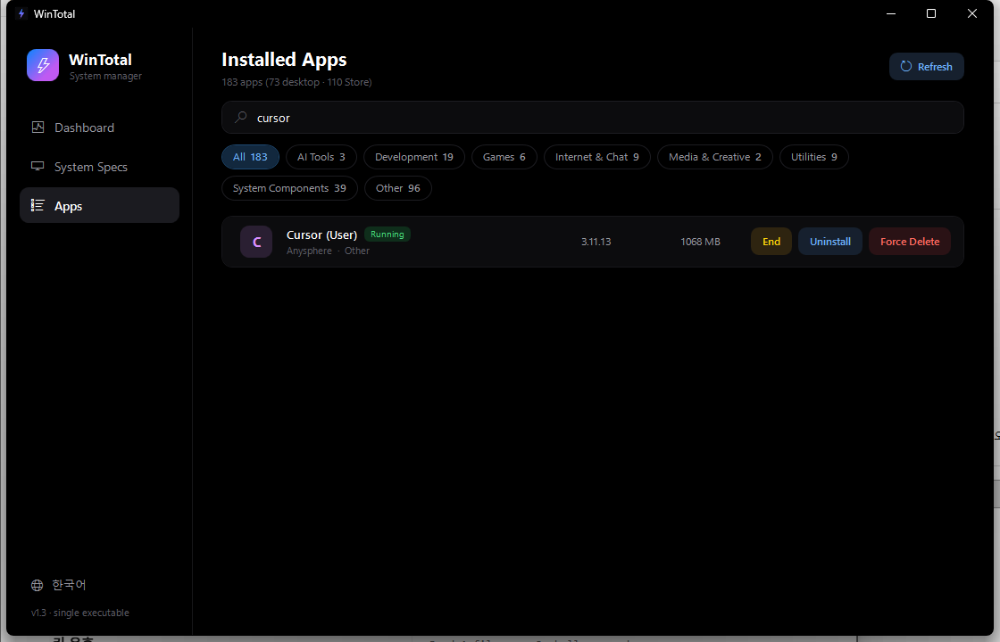
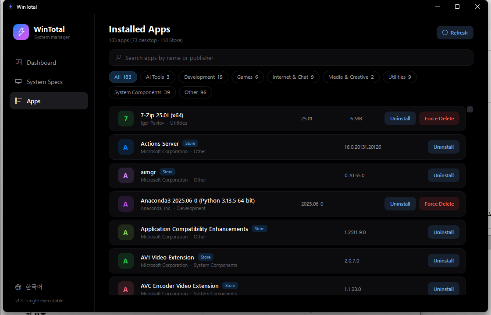

# ⚡ WinTotal

**An ultra-lightweight all-in-one Windows system utility — a single ~110 KB executable with zero dependencies.**

No installer. No frameworks to download. No background services. Just one file.



## Features

### 📊 Real-time Dashboard
- CPU · GPU · Memory · Disk usage refreshed every second, with 60-second history graphs
- GPU usage is computed the same way Task Manager does it (max across summed engine types)
- **Live GPU telemetry via nvidia-smi** — temperature, power draw, and VRAM (used / total) right on the GPU card
- **Top 5 CPU / GPU / memory processes** — including **per-process VRAM** (e.g. `python — 34% · 5.9 GB`), so you can see exactly what is eating your GPU during training
- **Graceful close button** on every process row: sends a close request first (so the app
  can ask you to save), waits 5 seconds, and only force-kills after you confirm.
  23 critical Windows processes are protected from termination

### 🖥️ System Specs
One click on **Rescan** re-scans the whole machine and shows proof of the scan
(timestamp · duration · sections · items verified).

- OS edition, build, install date / manufacturer & model
- CPU cores, threads, clocks, cache / GPU model, **VRAM**, driver, resolution
- Per-slot RAM details / storage with **NVMe · SSD · HDD detection**
- Motherboard & BIOS / connected monitors / **battery health (wear vs design capacity)**
- Secure Boot & TPM status / network adapters with link speed



### 🩺 Health Check
A compact strip at the top of the dashboard — runs automatically on startup and every
10 minutes, and expands into the full report when clicked:

- Disk SMART status, SSD wear level, disk temperature, free space per drive
- GPU temperature, thermal/power throttling, VRAM headroom, power draw vs limit
- Memory pressure and commit charge
- Battery wear (full-charge vs design capacity)
- Secure Boot, uptime (reboot reminder), thermal zone when the system exposes it


*Click the strip to expand the full green / yellow / red report.*

### 📦 App Manager
- Desktop apps (64/32-bit registry + per-user) and Microsoft Store apps in one list
- **Automatic categories** — AI Tools / Development / Games / Internet & Chat /
  Media & Creative / Security / Utilities / System Components
- Instant search across name, publisher, and package name
- **Uninstall**: runs the official uninstaller, then cleans leftover registry keys
- **Force Delete**: removes the registry entries and the install folder immediately —
  handy for apps that leave traces behind
- **Running detection**: apps with live processes get a green `Running` badge and an
  **End** button — close request first, confirmed force kill only as a last resort





### 🌐 English / Korean UI
Switch languages with one click (bottom-left globe button). The choice is remembered,
and the default follows your system language.

## Why is it so small?

- **Zero** external frameworks or libraries — only the .NET Framework 4.8 WPF that ships inside Windows
- The entire UI is built in code from a single source file — there isn't even any XAML
- It compiles with the `csc.exe` bundled with Windows — **no Visual Studio required**

## Build

```powershell
git clone https://github.com/SeanPresent/WindowsTotalManager.git
cd WindowsTotalManager
.\make_icon.ps1   # generate the app icon
.\build.ps1        # → WinTotal.exe  (release, requires admin at runtime)
.\build.ps1 -Dbg   # → WinTotal_dbg.exe  (testing build, no UAC)
```

Any Windows 10/11 machine can build it with those two lines.

## Notes on running

- **Administrator rights (UAC) are required** — HKLM registry cleanup needs them
- SmartScreen may warn about an unsigned executable → "More info → Run anyway".
  If you'd rather not trust a random binary, read `WinTotal.cs` and build it yourself —
  that's exactly why the source is here

## ⚠️ Disclaimer

**Force Delete** permanently removes registry keys and install folders.
Safeguards are in place (a protected-key list, exact-name matching only, system-path
guards), but this software is provided **AS IS**, without warranty of any kind.
Use at your own risk.

## License

[MIT](LICENSE)
